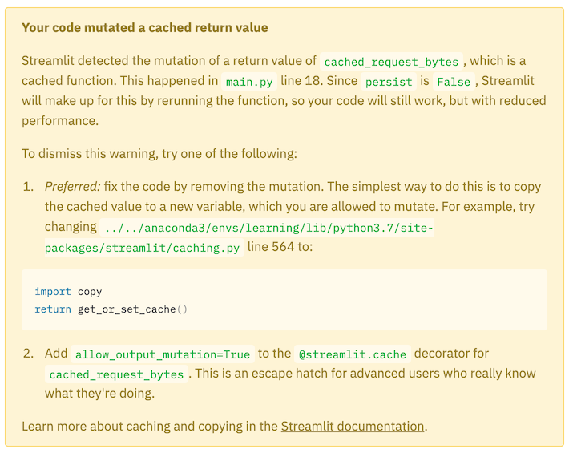

# itslit


```
rainier@makinitrain$ pip install streamlit
rainier@makinitrain$ streamlit main.py
```

## Interesting notes:

### On Caching (1)

Initializing a `BytesIO` object in the cached function, e.g.,

```python
@st.cache
def cached_request_bytes(url):
    content = requests.get(url).content
    content_bytes = BytesIO(content)
    return content_bytes
```

yielded this message on-screen:



Whereas

```python
@st.cache
def cached_request_bytes(url):
    content = requests.get(url).content
    return content

# and later using this result, constructing `BytesIO(result)` upon each use
```

did not.
